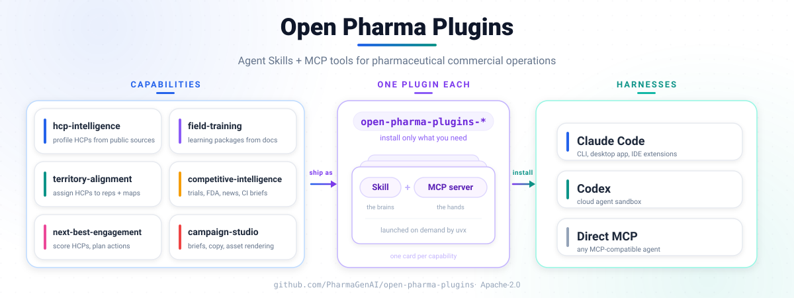

<section class="opp-hero" data-hero aria-labelledby="hero-title">
  

    
Open Pharma Plugins / Documentation

    <h1 id="hero-title">Open Pharma Plugins</h1>
    
A set of reviewable workflows for pharmaceutical commercial teams. Understand the business problem, inspect a fictional input and output, then follow the technical guide when you are ready to implement.

    

      <a class="opp-button opp-button--primary" href="get-started/">Get started</a>
      <a class="opp-button" href="#plugin-guides">Browse plugin guides</a>
    

  

</section>

<section class="quick-install" aria-labelledby="quick-install-title">
  

    
Installation

    <h2 id="quick-install-title">Choose an installation path</h2>
    
Install the complete plugin in an agent harness, or use the published Python distribution for a Python-managed MCP server.

    <a href="https://github.com/PharmaGenAI/open-pharma-plugins">Open the plugin repository →</a> 
    <a href="get-started/#pick-the-install-surface">Read the installation guidance →</a>
  

  

    <article class="quick-install__option">
      
Option 1 · Agent harness

      <h3>Claude Code or Codex</h3>
      Run the repository installer to add the Skill and MCP tools through the harness.
      <pre><code>git clone https://github.com/PharmaGenAI/open-pharma-plugins.git
cd open-pharma-plugins
less install.sh
bash install.sh</code></pre>
    </article>
    <article class="quick-install__option quick-install__option--python">
      
Option 2 · Python distribution

      <h3>Published package</h3>
      Install a released capability from the published Python distribution.
      <pre><code>python -m pip install \
  "open-pharma-plugins[hcp-intelligence]==2.2.1"</code></pre>
    </article>
  

</section>

<section class="reader-paths" aria-labelledby="reader-paths-title">
  <h2 id="reader-paths-title">Choose your reading path</h2>
  

    <a class="reader-path" href="outcomes/">
      For business teams
      <strong>Start with the decision</strong>
      
See the problem, the capability, the expected outcome, and the human review boundary in plain language.

      <em>Explore business outcomes →</em>
    </a>
    <a class="reader-path" href="get-started/">
      For technical teams
      <strong>Start with the implementation</strong>
      
Choose an install surface, inspect example files, and continue into version-pinned configuration and operations.

      <em>Open the implementation path →</em>
    </a>
  

</section>

## What problem does the portfolio solve?

  <section>
    Problem
    <h3>Important work is fragmented</h3>
    
Research, planning, training, and campaign preparation often happen across disconnected searches, files, and handoffs. Evidence and assumptions can disappear between steps.

  </section>
  <section>
    Solution
    <h3>Six focused, inspectable plugins</h3>
    
Each capability structures a narrow workflow and keeps its inputs, source support, constraints, and review status visible.

  </section>
  <section>
    Expected outcome
    <h3>A decision-ready artifact</h3>
    
Teams receive a cited profile, evidence brief, scenario, engagement plan, learning draft, or campaign review package that a qualified person can examine.

  </section>

<section class="architecture-overview" aria-labelledby="architecture-overview-title">
  

    
Portfolio architecture

    <h2 id="architecture-overview-title">How the portfolio fits together</h2>
    
Each capability stays independently installable, so teams can choose the workflow they need and bring its Skill and MCP tools into a supported agent environment.

  

  <figure class="architecture-diagram">
    
    <figcaption>Six focused capabilities, packaged one plugin at a time. <a href="assets/images/architecture.svg">Open the full-size diagram →</a></figcaption>
  </figure>
</section>

## Plugin guides { #plugin-guides }

Choose the question closest to the work in front of you. Every guide explains the problem, objective, workflow, fictional sample input, interpreted output, business value, and technical next step.

<section class="capability-table-section" aria-labelledby="portfolio-title">
  

    <strong id="portfolio-title">Six independent capabilities</strong>
    
Use one capability on its own, or connect outputs only where identifiers, provenance, and governance remain intact.

  

  <table class="capability-table">
    <thead>
      <tr><th scope="col">Capability</th><th scope="col">Business question</th><th scope="col">Expected output</th><th scope="col">Version</th></tr>
    </thead>
    <tbody>
      <tr><td data-label="Capability"><a href="capabilities/hcp-intelligence/">01<strong>HCP Intelligence</strong></a></td><td data-label="Business question">How do we prepare for an account conversation?</td><td data-label="Expected output">Cited public-source profile</td><td data-label="Version">HCP 1.0.2</td></tr>
      <tr><td data-label="Capability"><a href="capabilities/competitive-intelligence/">02<strong>Competitive Intelligence</strong></a></td><td data-label="Business question">What changed in the market?</td><td data-label="Expected output">Evidence brief and timeline</td><td data-label="Version">CI 1.1.0</td></tr>
      <tr><td data-label="Capability"><a href="capabilities/territory-alignment/">03<strong>Territory Alignment</strong></a></td><td data-label="Business question">Which coverage scenario works best?</td><td data-label="Expected output">Assignment and route scenario</td><td data-label="Version">TA 1.0.1</td></tr>
      <tr><td data-label="Capability"><a href="capabilities/next-best-engagement/">04<strong>Next-Best-Engagement</strong></a></td><td data-label="Business question">What should the team consider next?</td><td data-label="Expected output">Consent-aware engagement plan</td><td data-label="Version">NBE 1.0.2</td></tr>
      <tr><td data-label="Capability"><a href="capabilities/field-training/">05<strong>Field Training</strong></a></td><td data-label="Business question">How do we build learning from approved sources?</td><td data-label="Expected output">Learning and role-play draft</td><td data-label="Version">FT 1.1.1</td></tr>
      <tr><td data-label="Capability"><a href="capabilities/campaign-studio/">06<strong>Campaign Studio</strong></a></td><td data-label="Business question">How do we prepare material for review?</td><td data-label="Expected output">Campaign review package</td><td data-label="Version">CS 1.0.1</td></tr>
    </tbody>
  </table>
</section>

## Documentation contents

  <section>
    
Understand

    <h3>Purpose and outcomes</h3>
    <ul>
      <li><a href="outcomes/">Business outcomes</a> — match a decision to a capability</li>
      <li><a href="#plugin-guides">Plugin guides</a> — problem, solution, workflow, and value</li>
      <li><a href="trust-governance/">Trust and governance</a> — data, evidence, and review boundaries</li>
    </ul>
  </section>
  <section>
    
Try

    <h3>Installation and examples</h3>
    <ul>
      <li><a href="get-started/">Get started</a> — agent harness and Python distribution paths</li>
      <li><a href="examples/">Fictional examples</a> — input, output, and manifest for every plugin</li>
      <li><a href="assets/data/release.json">Release snapshot</a> — machine-readable version provenance</li>
    </ul>
  </section>
  <section>
    
Operate

    <h3>Technical references</h3>
    <ul>
      <li><a href="technical-reference/">Technical reference</a> — pinned configuration and repository guides</li>
      <li><a href="operations/release-sync/">Release sync</a> — website update and review contract</li>
      <li><a href="https://github.com/PharmaGenAI/pharmagenai.github.io">Website source</a> — public documentation repository</li>
    </ul>
  </section>

<aside class="evidence-note evidence-note--boundary" aria-labelledby="beta-boundary">
  <h2 id="beta-boundary">Human review is part of every workflow</h2>
  
Validate identity, source coverage, assumptions, data permissions, and rendered artifacts before operational use. Campaign and field-training materials are drafts for qualified medical, legal, and regulatory review—not evidence of approval. Recommendations do not replace accountable business, medical, legal, privacy, or regulatory judgement.

</aside>

## Technical truth stays with the release

This site explains business use and provides fictional examples. Package versions, installation commands,
release notes, schemas, and technical behavior remain canonical in the repository path linked from the
[technical reference page](technical-reference.md). The machine-readable [release snapshot](assets/data/release.json)
records the full pinned source commit `6bfc6ce43491d66b4ef45b1d3934a58648e1afc6`; the visible short SHA `6bfc6ce`
is derived from that full commit for display only.
